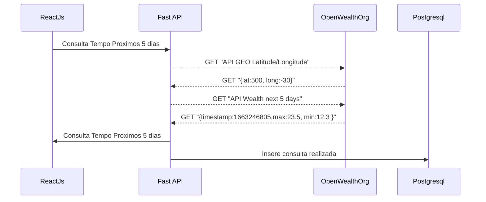
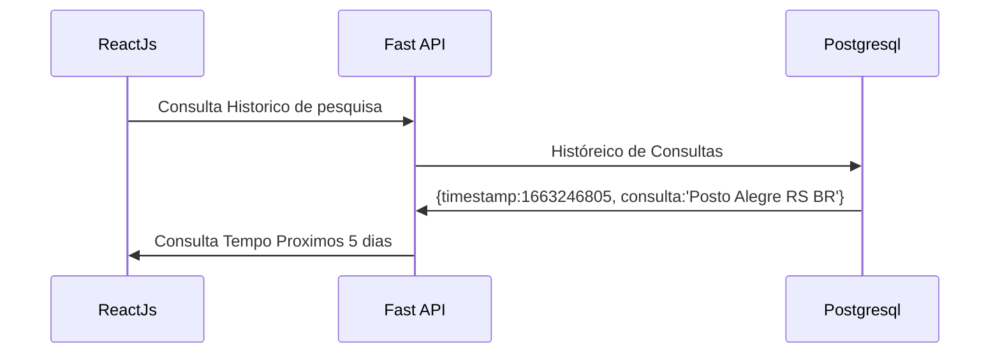

### API React JS
Utilizando a API de 5 dias é possivel ver o tempo com 3h de diferença num total de 40 pontos no JSON
- Meu token: b5812747ac712899d1de32c68ba565fd
- Endpoint: http://api.openweathermap.org/data/2.5/weather?q=London,uk&APPID=b5812747ac712899d1de32c68ba565fd
#### Observações: 
- [x] Adicionei a linguagem brasileira com "&lang=pt_br" como indicado na documentação para ver "tempo nublado" ao invés de "cloudy"
- [x] Adicionei a unidade celsius com "&units=metric" como indicado na documentação para ver "32" ao invés de "89.6"
- [x] converti o unix para uma data mais "humana" com a função "new Date(list[0].dt * 1000)"

#### Como a API usa latitude ao inves do nome da cidade utilizei uma API da mesma organização que permite converter cidade pra lat/long
- Endpoint: http://api.openweathermap.org/geo/1.0/direct?q={city name},{state code},{country code}&limit={limit}&appid={API key}

- Endpoint com token: https://api.openweathermap.org/geo/1.0/direct?q=porto%20alegre,RS,BR&limit=1&appid=b5812747ac712899d1de32c68ba565fd

### Principais arquivos
- Script de instalação			-> steps.txt
- Servidor Python FastAPI 	-> main.py
- Lógica do ReactJS 				-> src/app.js
- Template da pagina 			-> public/index.html

>Obs: adicionei bootstrap como css para melhorar a aparência

## Running
Instalar requisitos
- "apt install postgresql python3 python3-pip"
- "pip3 install -r requirements.txt"

Rodar backend - dentro da pasta react
- "python3 -m uvicorn main:app --reload"

Rodar frontend - dentro da pasta react/linx
- "npm start" 

### Endpoints
- React JS
http://127.0.0.1:3000/

- Fast API
http://127.0.0.1:8000/{path}

- Swagger
http://127.0.0.1:8000/docs

## PostgreSQL

Exemplo psql: 

| Id               |Timestamp (insercao)           |Consulta                         |
|----------------|-------------------------------|-----------------------------|
|1               | `Thu 15 Set 20:34:04`         |"Gravatai RS BR"            |
|2               | `Data Hora: Min: Seg`         |"Cidade Estado País"            |

## UML diagrams

Diagrama de fluxo da aplicação react

